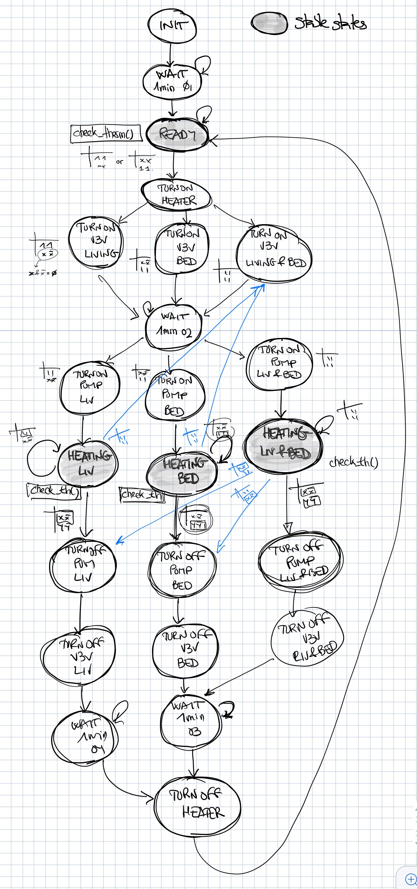

# pi-millenium
**Raspeberrypi-based** project to replace a broken, expensive and, propietary *Crouzet Millenium PLC* that manages a double heating circuit


### How to use the scripts
1. clone the git project
```
pi$ git clone https://github.com/jalcoriza/pi-millenium.git
```

2. run the main code
```
pi$ python3 millenium
```

3. Commands to interact with the main program
- Normal use

```
pi$ ./set_automate_mode.sh
```

- Basic test

```
pi$ ./test_heater_bedroom.sh
pi$ ./test_heaeter_livingroom..sh
```

- Low-level test

```
pi$ ./turn_on_heater.sh
pi$ ./turn_off_heater.sh

pi$ ./turn_on_v3v_livingroom.sh 
pi$ ./turn_off_v3v_livingroom.sh 

pi$ ./turn_on_v3v_bedroom.sh 
pi$ ./turn_off_v3v_bedroom.sh 

pi$ ./turn_on_pump_livingroom.sh 
pi$ ./turn_off_pump_livingroom.sh 

pi$ ./turn_on_pump_bedroom.sh 
pi$ ./turn_off_pump_bedroom.sh 
```


### Kanban funcionalities
#### to-do
- [ ] use integer states
- [ ] command for set any state
- [ ] dprint() funtion for different levels of logging

#### doing
- [ ] MVP (Minimum Viable Product)

#### done
- [x] read thermostate values
- [x] read date
- [x] read single-line commands from command.csv


### Images and Schematics repository
1. Project's goal


2. process_automate_mode's automaton's states diagram




